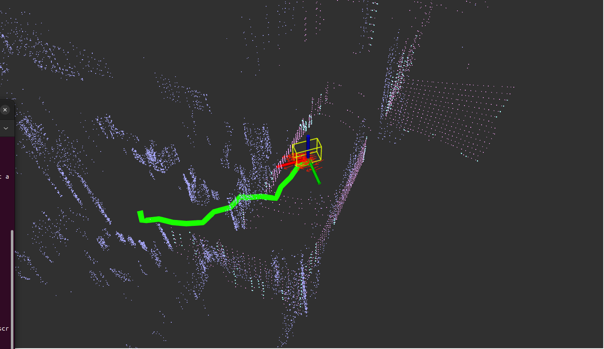

# Go2 XT16 Wall-Crossing Case: 2026-07-10

Case status: **0.50 m field planning failed as predicted; 0.40 m candidate passes offline, synthetic, and no-motion runtime checks; field goal pending**

This case is a follow-up to
`docs/go2_xt16_navigation_review_20260710.md`. It records the latest navigation
run shown at 08:07:25 on 2026-07-10 and the first wall-rejection fix. It does not
authorize an unsupervised live run.

## Evidence

Screenshot:



Related adapter log:

`run_logs/go2_xt16_nav_live_x050_yaw050_20260710_080322_adapter.log`

The screenshot's thick green path is the `GlobalPath` display configured at
`src/dddmr_beginner_guide/rviz/go2_xt16_navigation.rviz:281-308`. Its topic is
`/awared_global_path`, which is published from the global planner result. The
path crosses a visually continuous wall to the robot's left/front. This
classifies the primary failure as **global path crosses an observed wall**.

The same run log contains 416 throttled Move log entries and 96 StopMove log
entries. It transitions through controlling, waiting, planning, and then a long
recovery-wait interval. These are log-entry counts, not exact publication
counts, because Move logging is throttled while the adapter publishes at its
configured rate.

## Was the Wall Point Cloud Too Sparse?

Not as the primary cause.

The RViz view overlays several clouds:

- `SubMap` (`/sub_mapcloud`) in pale blue;
- live less-sharp features in cyan; and
- live less-flat surface features in magenta.

The static planner subscribes to `map1/mapcloud`, which the pose-graph map server
builds from feature keyframes. Surface keyframes are published separately as
`map1/mapsurface` and are not part of the static planner input. A plain wall can
therefore look dense in RViz while its static feature representation is
sparser. This remains a secondary risk.

An offline 0.2 m voxel approximation of the selected map found:

```text
feature voxels: 2805
surface voxels: 9152
ground voxels: 2717
feature candidates per ground node: median=13, p90=35, p95=43
ground nodes meeting the existing >=11 feature threshold: 1538/2717
```

This shows that the feature map is not globally below the point threshold. More
importantly, the pre-fix code assigned every detected static obstacle node a
`dGraph` value of `0.25`, while the configuration rejected only values below
`inscribed_radius=0.1`. Consequently, even a wall that passed the point-count
test was not lethal.

Blindly adding every surface point or lowering the count threshold is not safe
with the current map. The same offline approximation found that combining
feature and surface points at the current threshold would classify 2292/2717
ground nodes as obstacle-associated and fragment the free graph. The known
false/low ground layers must be addressed before broadening the static obstacle
source.

## Confirmed Root Causes

### 1. Detected static walls were assigned a non-lethal value

Pre-fix behavior:

```text
StaticLayer wall-associated node value = 0.25
A* rejects when dGraphValue < inscribed_radius
configured inscribed_radius = 0.1
0.25 < 0.1 is false
```

The wall produced a cost increase but remained traversable.

### 2. Safety distances were below the robot envelope

The local collision cuboid has a maximum XY corner radius of approximately
`0.457 m`. Both local and global `inscribed_radius` and `inflation_radius` were
`0.1 m`. Dynamic obstacle projection also searched only `0.1 m` around an
observed cluster, so a wall between 0.2 m ground samples could fail to mark a
usable ground node.

### 3. Local LiDAR voxel resolution was zero

The local config used `resolution`, but `MultiLayerSpinningLidar` reads
`xy_resolution`. Runtime evidence showed `xy_resolution: 0.00`, making local
marking and clearing unsuitable as a fallback against a bad global path.

### 4. Sparse A* expansion used mismatched distance data

When fewer than eight neighbors were found, A* replaced the neighbor index
vector with a larger-radius result but retained the old squared-distance
vector. This could corrupt path costs or read beyond the vector.

## Initial Fix

The initial `0.32 m`/`0.35 m` revision included:

- local and global centerline `inscribed_radius: 0.32`;
- local and global `inflation_radius: 1.5`;
- local `path_blocked_strategy.check_radius: 0.3`;
- local `xy_resolution: 0.05`;
- positive-resolution startup rejection in `MultiLayerSpinningLidar`;
- configurable `static_obstacle_min_points` with the current value retained at
  11;
- configurable static classification XY radius, set to `0.35 m` for this map;
- static obstacle-associated ground nodes retain their measured horizontal
  distance instead of receiving a fixed cost or zero;
- static lethal nodes included in the planner's line-of-sight cloud;
- matched neighbor-index and squared-distance vectors in sparse A* expansion;
  and
- explicit static-obstacle node count logging.

The `0.32 m` centerline clearance covers the configured `0.18 m` body
half-width plus `0.14 m` for localization and tracking error. The oriented
local collision cuboid still checks the longer `0.42 m` fore/aft extent. This
avoids treating the `0.457 m` circumscribed radius as a direction-independent
doorway requirement.

## Initial Regression Evidence

Build:

```text
colcon build --packages-up-to global_planner
Summary: 3 packages finished
```

Configuration gate:

```text
robot_xy_radius=0.457
robot_half_width=0.180
minimum_centerline_clearance=0.280
perception_3d_local.inscribed_radius=0.320
perception_3d_local.inflation_radius=1.500
perception_3d_global.inscribed_radius=0.320
perception_3d_global.inflation_radius=1.500
static_obstacle_xy_radius=0.350
GO2_XT16_WALL_SAFETY_CONFIG_STATUS=PASS
```

Synthetic ROS 2 integration test on isolated domain 231:

```text
same_side_status=4 same_side_poses=9
cross_wall_status=6 cross_wall_poses=0
SYNTHETIC_WALL_REJECTION_STATUS=PASS
```

Doorway controls using the same built `StaticLayer + A*` chain also pass:

```text
gap_width=0.80 m: cross_wall_status=4 cross_wall_poses=26
gap_width=1.40 m: cross_wall_status=4 cross_wall_poses=23
SYNTHETIC_DOORWAY_PASSAGE_STATUS=PASS
```

The test publishes only synthetic map, ground, sensor, and TF messages. It does
not publish a velocity or Sport request. It confirms that the actual
`StaticLayer + A*` chain can plan on one side of a wall and rejects a goal across
a wall with no opening. Its 0.4 m ground grid also forces the fewer-than-eight
neighbor branch, covering the corrected expanded-radius vector handling.

Commands:

```bash
scripts/check_go2_xt16_wall_safety_config.py
scripts/check_go2_xt16_synthetic_wall_rejection.py
```

The synthetic test must run in an environment containing the newly built
`perception_3d`, `global_planner`, and `dddmr_sys_core` packages.

## First Supervised Field Result and Revision

The first supervised live run used a `0.50 m` hard radius and assigned zero to
every classified static node. It did not provide usable doorway behavior:

- the planner initially entered `d_controlling` and published up to
  `x=0.30 m/s`;
- it then lost the plan, remained in `d_planning_waitdone`, and entered
  `d_recovery_waitdone`;
- the old adapter admitted recovery yaw commands up to `-0.25 rad/s`; and
- subsequent goals could not produce a path out through the doorway.

The run was stopped. The adapter log confirms receipt of `SIGTERM` followed by
three shutdown `StopMove` requests. A lifecycle defect was also found: an
arbitrary `NAV_CONTAINER_NAME` was not matched by the old prefix-only stop
logic. Navigation containers are now labeled and tracked explicitly, and a
no-motion lifecycle test proved that an arbitrary labeled name is stopped and
removed.

Exact offline replay of the selected map reproduces the runtime map sizes
(`2130` feature points and `2717` ground nodes) and the over-restriction:

```text
XY window  classified  lethal  largest component  start component
0.25 m     445         445     2268               2268
0.30 m     631         631     2077               2077
0.32 m     723         721     1989               1989
0.35 m     846         838     1874               1874
0.50 m     1446        1206    1432               71
```

The `0.35 m` classification window with `0.32 m` measured-distance lethal
threshold restores the start to the main map component while retaining a
conservative doorway clearance. The Sport adapter now requires a fresh planner
decision and permits motion only in `d_controlling`, `d_align_heading`, or
`d_align_goal_heading`; planning, waiting, and recovery states issue StopMove.
No-motion probes confirmed both the recovery block and the controlling pass.

## Operator-Requested Clearance Experiments

The operator subsequently reported that the `0.32 m`/`0.35 m` revision
successfully produced the required field path. During a supervised live trial,
the resulting obstacle clearance was judged too small. On operator request, a
`0.50 m` trial used:

```text
perception_3d_local.inscribed_radius=0.50
perception_3d_global.inscribed_radius=0.50
perception_3d_global.map.static_obstacle_xy_radius=0.50
```

The static classification window was raised with the hard radius; leaving it
at `0.35 m` would create an unclassified band inside the requested `0.50 m`
clearance. The configuration gate passes, and the synthetic 0.8 m and 1.4 m
doorway controls still return paths. Those coarse synthetic controls do not
establish connectivity on the selected real map.

Exact real-map replay predicts a regression:

```text
classified=1446/2717
lethal=1437/2717
free=1280/2717
components=6
largest_component=1050
start_component=62
```

The start was therefore no longer in the main component. The operator's field
planning check confirmed that no path could be produced with `0.50 m`.

The current candidate reduces all three coupled values to `0.40 m`:

```text
perception_3d_local.inscribed_radius=0.40
perception_3d_global.inscribed_radius=0.40
perception_3d_global.map.static_obstacle_xy_radius=0.40
```

Exact real-map replay now places the start back in the main component:

```text
classified=1074/2717
lethal=1071/2717
free=1646/2717
components=2
largest_component=1642
start_component=1642
```

The closed-wall rejection and both 0.8 m and 1.4 m synthetic doorway controls
pass. A 30-second real-sensor, no-Sport runtime loaded both hard radii at
`0.40 m`, reported the same `1074/2717` classified and `1071/2717` lethal
counts, and exited at its expected timeout without leaving a container or
adapter. The exact field start-to-door goal remains the acceptance gate before
another live run.

### Goal completion tolerance experiment

On operator request, the current trial configuration sets both local-planner
goal tolerances to `1.0`:

```text
xy_goal_tolerance=1.0 m
yaw_goal_tolerance=1.0 rad (about 57.3 degrees)
```

This is intentionally looser than the previous `0.4 m`/`0.8 rad` values. The
planner can now declare success on a single control cycle inside those bounds;
there is no dwell-time or stopped-velocity requirement. These are experimental
values and have not yet received field acceptance.

### Live DDS readiness discovery

A supervised `0.40 m` live launch on 2026-07-10 reached all navigation, map,
and safe-velocity readiness gates but timed out after 45 seconds waiting for
`/api/sport/request`. The live adapter had not been started, and the cleanup
trap removed the navigation container. A subsequent no-Sport probe found the
Go2 contracts intact: `/lowstate` and `/sportmodestate` each had one publisher,
and `/api/sport/request` had one subscriber.

A repeated launch showed that `/api/sport/request` was present with the correct
type and one subscriber while the launcher still reported it missing. The
probe used `grep -q` under `pipefail`; an early match closed the pipe and made
`ros2 topic list` exit with `BrokenPipe`, turning a successful match into a
failed pipeline. The node/topic probes now consume the full list instead.

At the operator's request, the subscriber-only `/api/sport/request` startup
gate was removed as redundant. Live startup still requires the expected
`/lowstate` and `/sportmodestate` types with at least one publisher each before
starting the adapter. Confirmation, bounded runtime, decision-state gating,
and cleanup remain mandatory. Each wait reports ready/still-waiting progress
and detects an exited container without waiting out the full timeout.

## Active XT16 Rate/Resolution Decision

The operator intentionally changed the XT16 driver from 64000 points per scan
to 32000 points per scan because the former delivered about 5 Hz and the latter
delivers about 10 Hz. Read-only preflight on 2026-07-10 confirmed the active
contract:

```text
width=32000, rings=16, points_per_ring=2000
point_step=26, timestamp_span=0.099..0.100 s
receive_rate=about 10 Hz
```

The navigation range image was still configured for 4000 horizontal columns.
Two otherwise identical 60-second, no-Sport-output navigation runs compared
the mismatched and matched configurations:

```text
range-image columns       4000              2000
segmented_cloud_pure      8.5..9.0 Hz       9.96..10.01 Hz
sample output width       40538             20577
global lidar cadence      repeated ~0.20 s  kept the 0.10 s input cadence
static classified nodes   1446/2717         1446/2717
```

The extra output points in the 4000-column case are not extra sensor
measurements; the input still contains only 32000 points and the oversized
range image includes patched/projected structure. Matching 2000 columns keeps
adjacent physical samples adjacent and restores the downstream rate.

Decision: use 32000 points at 10 Hz with `num_horizontal_scans: 2000` for live
navigation. At 0.18 degree horizontal spacing, adjacent samples are still only
about 31 mm apart at 10 m, below the 50 mm online perception voxel size. The
100 ms update period is more valuable to this closed loop than the 0.09 degree
spacing of the measured 5 Hz mode. Reserve 64000 points at 5 Hz for deliberate
low-speed mapping comparisons, with a matching 4000-column configuration.

## Required Field Acceptance

Before another live Sport adapter run:

1. Rebuild the deployment install/image from the current working tree.
2. Run `scripts/check_go2_xt16_wall_safety_config.py` and require PASS.
3. Start navigation with Sport output gated off.
4. Repeat the same start/goal selection from this case.
5. Confirm the startup log reports both classified and lethal static-node
   counts and that they are consistent with the offline replay.
6. Confirm `/awared_global_path` goes around the wall or returns no path.
7. Inspect `/perception_3d_ros/dGraph` and
   `/perception_3d_global/lidar/global_marking` at the wall.
8. Record the expanded topic set with
   `scripts/record_go2_xt16_nav_debug_bag.sh`.

Because the first field run exposed both graph disconnection and recovery
motion, the revised parameters must first pass the no-Sport-output goal check.
The generic live launcher now requires an explicit supervision phrase, bounded
runtime, decision-state gate, and cleanup trap; it must not be run unbounded.

## Remaining Risks

- The static map uses feature points and can underrepresent smooth wall planes.
- The current ground layer contains low/disconnected samples and still lacks
  explicit slope, step, and drop edge limits.
- The first fix has not yet been replayed against the exact 08:07 path because
  that run did not retain a ROS bag containing the path, dGraph, and map topics.
- Synthetic rejection and offline connectivity prove the revised mechanisms,
  not field acceptance on the selected map.
